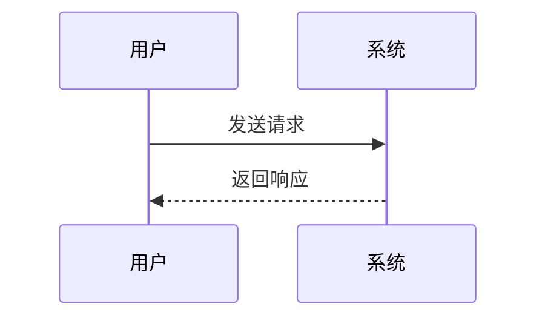
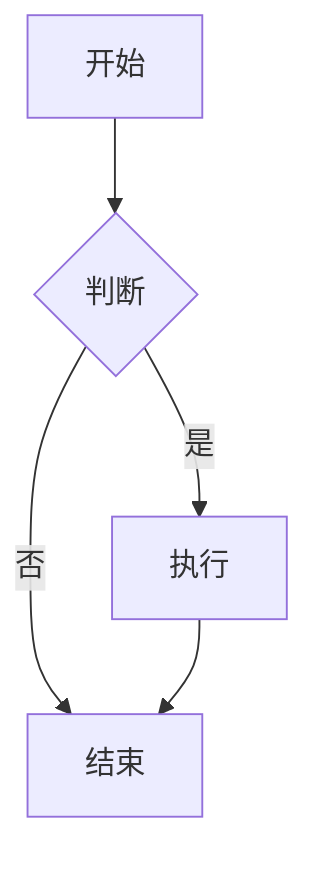

# Mermaid 测试页面

这是一个简单的测试页面，用来验证 Mermaid 是否正常工作。

## 简单时序图

```mermaid
sequenceDiagram
    participant A as 用户
    participant B as 系统

    A->>B: 发送请求
    B-->>A: 返回响应
```

## 简单流程图

```mermaid
flowchart TD
    A[开始] --> B{判断}
    B -->|是| C[执行]
    B -->|否| D[结束]
    C --> D
```

如果这些图表能正常显示，说明 Mermaid 插件工作正常。
