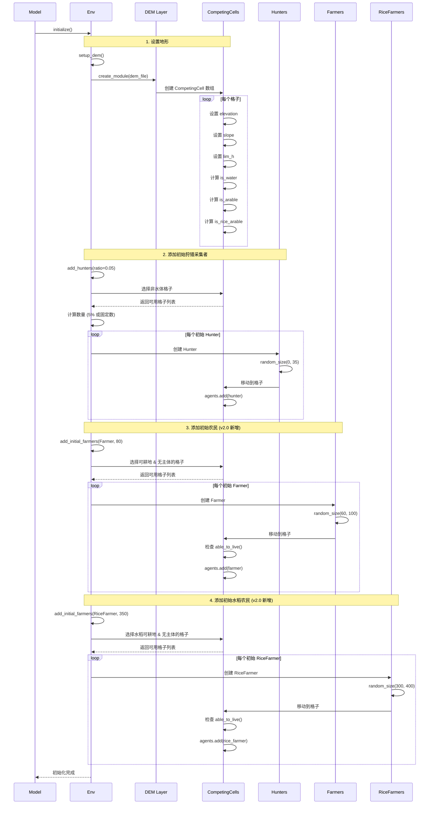
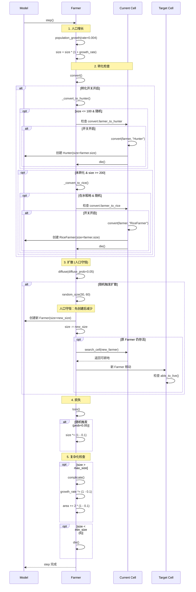
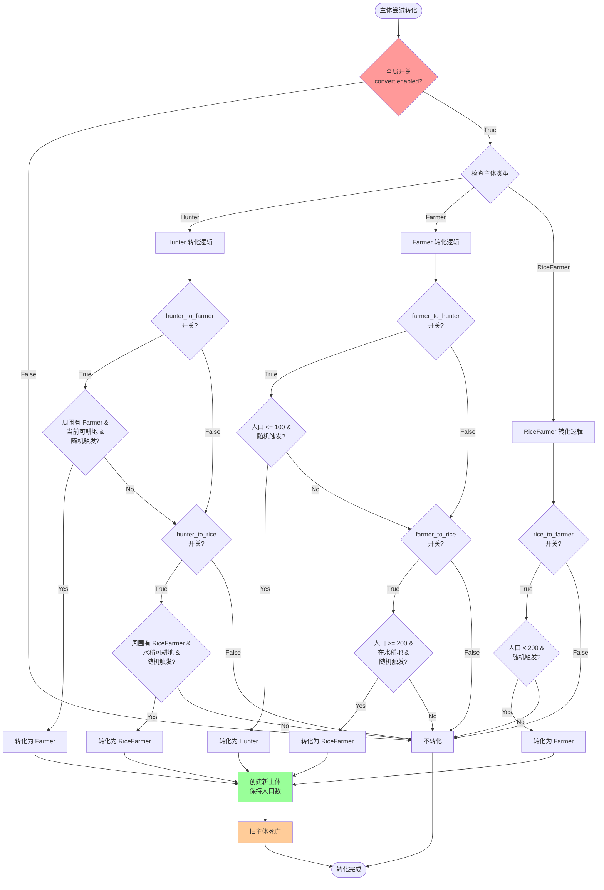
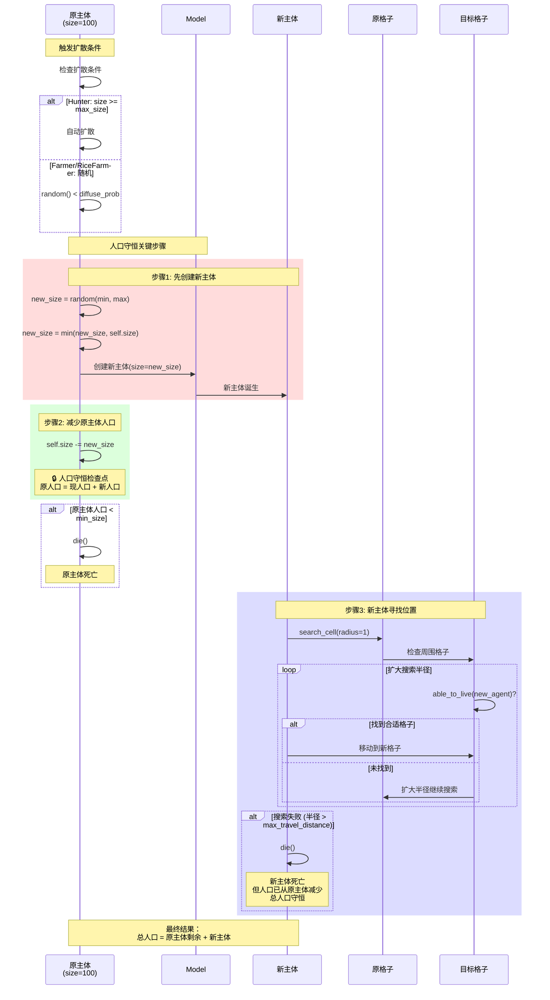
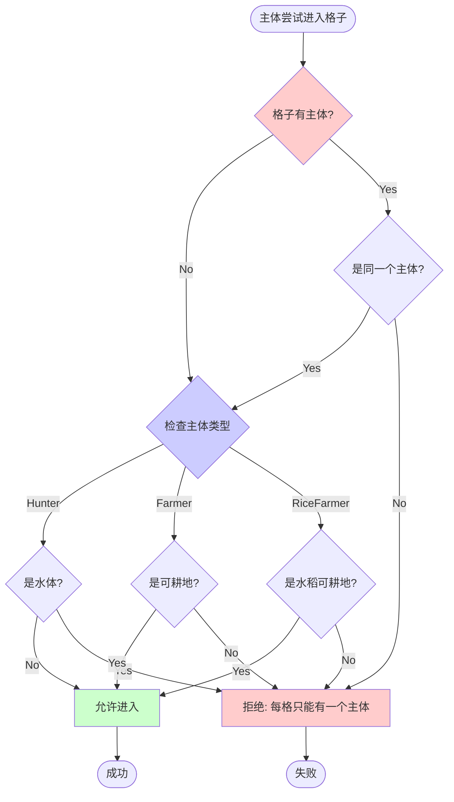
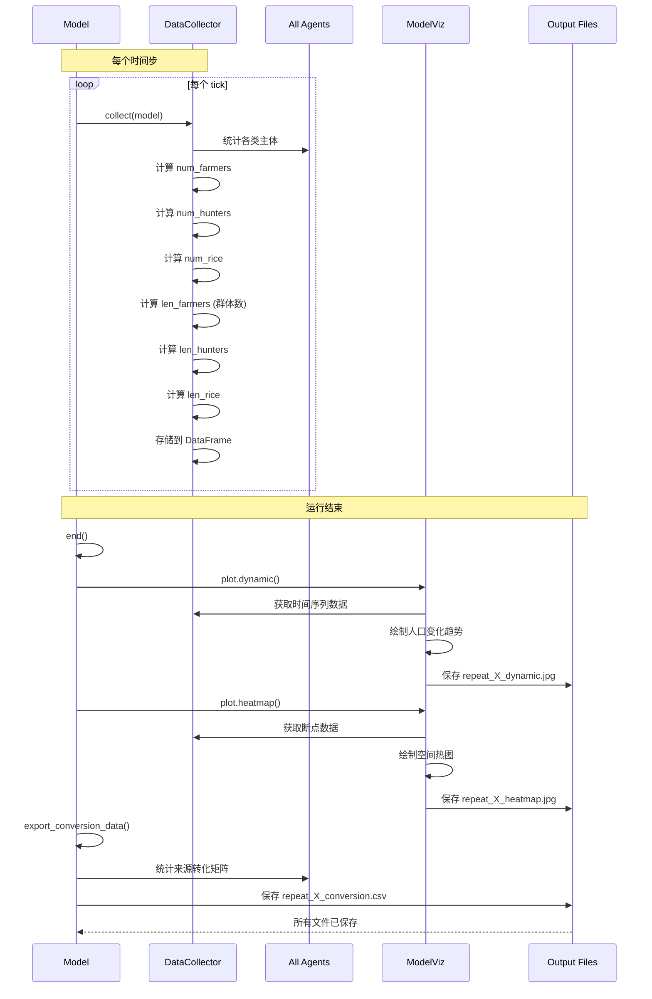

# 模型详细时序图

本文档通过时序图详细说明华南生计演变模型的运行流程。

## 完整运行时序

```mermaid
sequenceDiagram
    participant User as 用户
    participant Exp as MyExperiment
    participant Model as Model
    participant Env as Environment
    participant H as Hunter
    participant F as Farmer
    participant RF as RiceFarmer
    participant Cell as CompetingCell

    Note over User,Cell: 初始化阶段

    User->>Exp: 运行实验 (batch_run)
    Exp->>Model: 创建模型实例
    Model->>Env: initialize()

    Note over Env,Cell: 环境初始化
    Env->>Env: setup_dem()
    Env->>Cell: 加载 DEM 数据
    Env->>Cell: 加载 Slope 数据
    Env->>Cell: 加载 lim_h 数据

    Note over Env,H: 添加初始 Hunters
    Env->>Env: add_hunters(0.05)
    Env->>Cell: 选择非水体格子
    Env->>H: 创建 Hunter (init_size: 6-35)
    H->>Cell: 移动到格子

    Note over Env,F: 添加初始 Farmers (新增)
    Env->>Env: add_initial_farmers(80)
    Env->>Cell: 选择可耕地
    Env->>F: 创建 Farmer (init_size: 60-100)
    F->>Cell: 移动到格子

    Note over Env,RF: 添加初始 RiceFarmers (新增)
    Env->>Env: add_initial_farmers(350)
    Env->>Cell: 选择水稻可耕地
    Env->>RF: 创建 RiceFarmer (init_size: 300-400)
    RF->>Cell: 移动到格子

    Note over User,Cell: 运行阶段 (每个 Tick)

    loop 每个时间步 (tick)
        Model->>Env: env.step()

        Note over Env,F: 环境步骤：添加新主体
        Env->>Env: add_farmers(Farmer)
        Env->>F: 泊松分布创建新 Farmers
        Env->>Env: add_farmers(RiceFarmer)
        Env->>RF: 泊松分布创建新 RiceFarmers

        Note over Model,RF: 主体步骤：随机执行
        Model->>Model: agents.shuffle_do("step")

        alt 选中 Hunter
            Model->>H: step()
            H->>H: population_growth()
            H->>H: convert() [检查转化开关]
            opt 转化开关开启 & 满足条件
                H->>Cell: convert(to="Farmer")
                Cell->>Cell: 检查 convert.hunter_to_farmer
                Cell->>F: 创建新 Farmer
                Cell->>H: 死亡
            end
            H->>H: diffuse()
            opt 人口 >= max_size
                H->>H: 创建新 Hunter
                H->>Cell: 搜索合适格子
                Cell-->>H: 返回目标格子
            end
            H->>H: loss() [新增]
            opt 随机损失触发
                H->>H: size *= (1 - loss.rate)
            end
            H->>H: move_one()
            opt 不是定居型 (size <= 100)
                H->>Cell: 搜索更好的格子
                opt 遇到另一个 Hunter
                    H->>H: merge(other_hunter)
                    Note over H: 人口守恒：size = size1 + size2
                end
            end
        else 选中 Farmer
            Model->>F: step()
            F->>F: population_growth()
            F->>F: convert() [检查转化开关]
            opt 转化开关开启 & 满足条件
                alt 人口 <= 100 & 随机
                    F->>Cell: convert(to="Hunter")
                    Cell->>H: 创建新 Hunter
                else 人口 >= 200 & 在水稻地
                    F->>Cell: convert(to="RiceFarmer")
                    Cell->>RF: 创建新 RiceFarmer
                end
            end
            F->>F: diffuse()
            opt 随机扩散触发
                F->>F: 创建新 Farmer
                Note over F: 人口守恒：原主体先减人口
                F->>Cell: 搜索可耕地
            end
            F->>F: loss()
            opt 随机损失触发
                F->>F: size *= (1 - loss.rate)
            end
        else 选中 RiceFarmer
            Model->>RF: step()
            RF->>RF: population_growth()
            RF->>RF: convert() [检查转化开关]
            opt 人口 < 200 & 随机
                RF->>Cell: convert(to="Farmer")
                Cell->>F: 创建新 Farmer
            end
            RF->>RF: diffuse()
            RF->>RF: loss()
        end

        Note over Model: 检查死亡条件
        alt 主体人口 < min_size
            Model->>H: die()
            Model->>F: die()
            Model->>RF: die()
        end

        Model->>Model: datacollector.collect()
    end

    Note over User,Cell: 结束阶段

    Model->>Model: end()
    Model->>Model: plot.dynamic()
    Model->>Model: plot.heatmap()
    Model->>Model: export_conversion_data()
    Model-->>Exp: 返回结果
    Exp-->>User: 保存结果文件
```



## 初始化详细流程



## Hunter 行为详细流程

```mermaid
sequenceDiagram
    participant Model
    participant H as Hunter
    participant Cell as Current Cell
    participant NewCell as Target Cell
    participant Other as Other Hunter

    Model->>H: step()

    Note over H: 1. 人口增长
    H->>H: population_growth(rate=0.0008)
    H->>H: size = size * (1 + growth_rate)

    Note over H,Cell: 2. 转化检查 (v2.0: 可关闭)
    H->>H: convert()

    alt 转化开关开启
        H->>H: _convert_to_farmer()
        opt 周围有 Farmer & 当前可耕地 & 随机
            H->>Cell: 检查 convert.hunter_to_farmer
            alt 开关开启
                Cell->>Cell: convert(hunter, "Farmer")
                Cell->>Model: 创建 Farmer(size=hunter.size)
                Cell->>H: die()
            end
        end

        opt 未转化为 Farmer
            H->>H: _convert_to_rice()
            opt 周围有 RiceFarmer & 水稻地 & 随机
                H->>Cell: 检查 convert.hunter_to_rice
                alt 开关开启
                    Cell->>Cell: convert(hunter, "RiceFarmer")
                    Cell->>Model: 创建 RiceFarmer(size=hunter.size)
                    Cell->>H: die()
                end
            end
        end
    end

    Note over H: 3. 扩散 (人口守恒)
    H->>H: diffuse()

    alt 人口 >= max_size
        H->>H: 计算 max_size
        alt 临近水体
            H->>H: max_size = 500
        else 普通情况
            H->>H: max_size = 100
        end

        H->>Model: 创建新 Hunter
        Note over H: 人口守恒：先减后创建
        H->>H: size -= new_size

        opt 原 Hunter 仍存活
            H->>Cell: search_cell(new_hunter)
            Cell-->>H: 返回合适格子
            H->>NewCell: 新 Hunter 移动到目标格子
        else 原 Hunter 死亡
            H->>H: 新 Hunter 也死亡
        end
    end

    Note over H: 4. 损失 (v2.0 新增)
    H->>H: loss()

    alt 随机触发 (prob=0.05)
        H->>H: size *= (1 - 0.1)
        Note over H: 人口减少 10%
    end

    Note over H,NewCell: 5. 移动
    H->>H: move_one()

    alt 非定居型 (size <= 100)
        H->>Cell: neighboring(radius=1)
        Cell-->>H: 返回周围格子

        loop 搜索合适格子
            H->>NewCell: 检查 able_to_live(hunter)

            alt 格子有其他 Hunter
                H->>Other: 合并
                Note over H,Other: merge(): size = h1.size + h2.size
                Other->>Other: size = self.size + h.size
                H->>H: die()
            else 格子有其他主体
                NewCell-->>H: False (不能进入)
            else 格子为空 & 非水体
                H->>NewCell: 移动到新格子
            end
        end
    end

    opt 人口 < min_size (6)
        H->>H: die()
    end

    H-->>Model: step 完成
```

## Farmer 行为详细流程



## 转化机制详细流程 (v2.0 新增开关控制)



## 扩散机制与人口守恒 (v2.0 改进)



## 格子规则检查流程 (v2.0 新增每格唯一主体)



## 数据收集与可视化流程



## 使用说明

### 在文档中嵌入时序图

这些时序图使用 Mermaid 语法编写，会自动在文档中渲染成可交互的图表。

### 查看时序图

1. 启动文档服务器：`poetry run mkdocs serve`
2. 访问此页面查看完整的交互式时序图
3. 可以缩放、导出 SVG/PNG

### 修改时序图

直接编辑本文件中的 Mermaid 代码块，保存后自动更新。

## 关键流程说明

### v2.0 重要变更在时序图中的体现

1. **转化机制开关**：每个转化操作都会检查对应的开关
2. **人口守恒**：扩散时先创建新主体，再减少原主体人口
3. **损失机制**：Hunter 现在也有 loss() 步骤
4. **每格唯一**：able_to_live() 检查格子是否已有其他主体
5. **初始化**：同时创建三类主体，不再等待特定 tick

### 关键时间点

- **tick=0**：初始化，创建所有三类主体
- **每个 tick**：
  1. 环境步骤（添加新主体）
  2. 主体步骤（随机执行所有主体的 step）
  3. 数据收集
- **tick=end**：结束，绘图和导出数据

## 参考文档

- [工作流程](../usage/workflow.md) - 文字描述
- [变更日志](changelog_v2.md) - 详细变更说明
- [配置文件](../usage/config.md) - 参数说明

