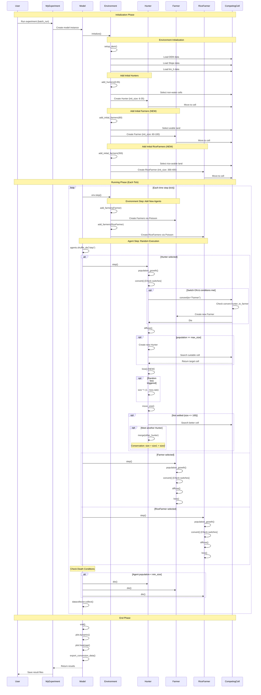
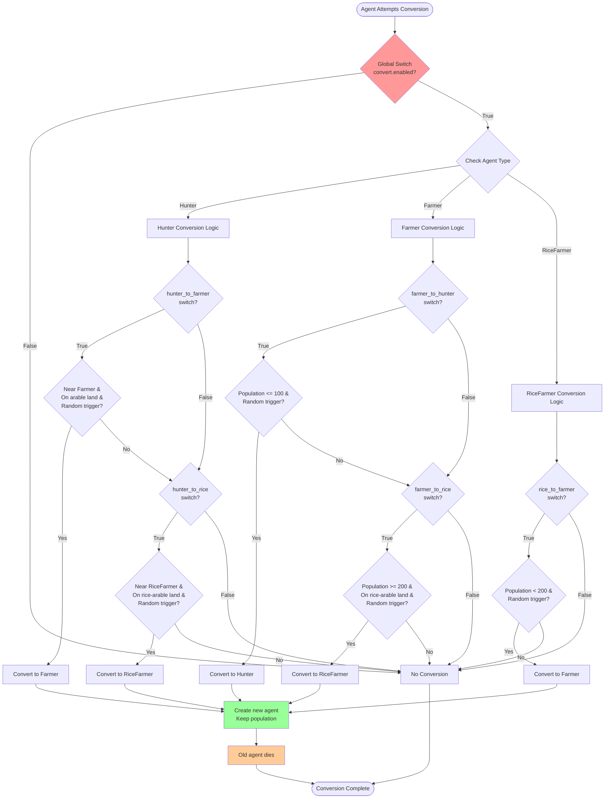
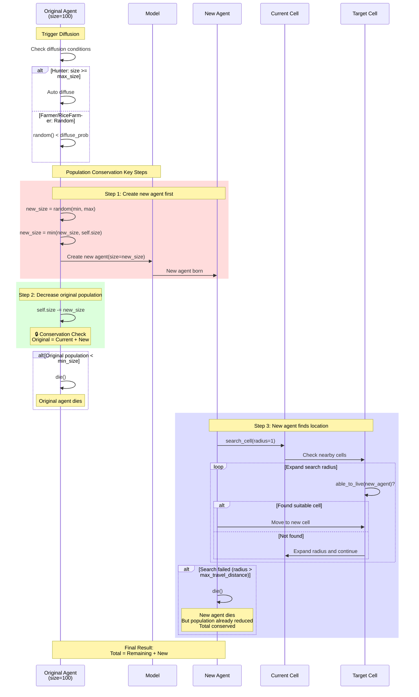
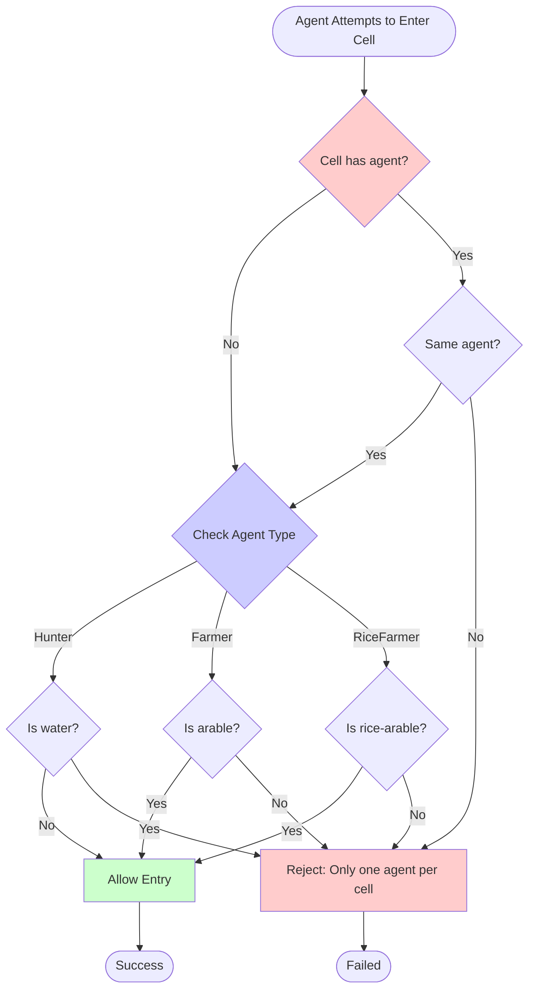

# Model Detailed Sequence Diagrams

This document illustrates the running process of the South China Livelihood Evolution Model through sequence diagrams.

## Complete Run Sequence

## Conversion Mechanism (v2.0 with Switch Control)

## Diffusion & Population Conservation (v2.0 Improved)

## Cell Rule Check (v2.0: One Agent Per Cell)

## Usage

### Embedding Sequence Diagrams in Documentation

These sequence diagrams are written in Mermaid syntax and will be automatically rendered as interactive charts in the documentation.

### Viewing Diagrams

1. Start documentation server: `poetry run mkdocs serve`
2. Visit this page to view complete interactive sequence diagrams
3. Can zoom, export to SVG/PNG

### Modifying Diagrams

Directly edit the Mermaid code blocks in this file; changes update automatically.

## Key Process Descriptions

### v2.0 Important Changes Reflected in Diagrams

1. **Conversion Switches**: Each conversion operation checks corresponding switch
2. **Population Conservation**: Create new agent first, then decrease original population during diffusion
3. **Loss Mechanism**: Hunter now has loss() step
4. **One Per Cell**: able_to_live() checks if cell already has other agents
5. **Initialization**: All three agent types created simultaneously, no waiting for specific ticks

### Key Time Points

- **tick=0**: Initialize, create all three agent types
- **Each tick**:
  1. Environment step (add new agents)
  2. Agent step (randomly execute all agents' steps)
  3. Data collection
- **tick=end**: End, plot and export data

## Reference Documentation

- [Workflow](../usage/workflow.en.md) - Text description
- [Changelog](changelog_v2.en.md) - Detailed changes
- [Configuration](../usage/config.en.md) - Parameter descriptions

